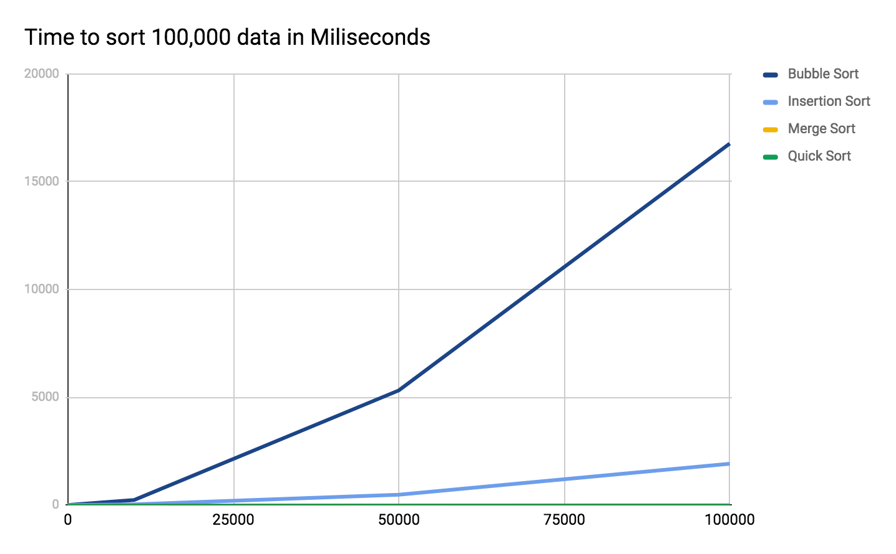

For Bubble Sort: 237ms elapsed 
For Insertion Sort: 28ms elapsed 
For Merge Sort: 4ms elapsed 
For Quick Sort: 3ms elapsed 
For Bubble Sort: 5361ms elapsed 
For Insertion Sort: 479ms elapsed 
For Merge Sort: 7ms elapsed 
For Quick Sort: 3ms elapsed 
For Bubble Sort: 16654ms elapsed 
For Insertion Sort: 1888ms elapsed 
For Merge Sort: 14ms elapsed 
For Quick Sort: 5ms elapsed 

# Data Structures and Algorithms Coursework
By Shannon Sullivan

## Part I: Analysis of Sorting Algorithms
To compare the efficiency of different sorting algorithms, I have generated a large array of random numbers. The array was then "copied" using the Java `Array.clone()` method, and passed to the following three sorting algorithms:

* Bubble sort
* Insertion sort
* Merge sort

To capture the time necessary to complete the sorting methods I utilized the Java `Date()` object. I applied the `getTime()` method at the start and end of each sorting method call and calculated the time elapsed.

Figure 1 illustrates a comparison of the amount of time elapsed for each of the three algorithms.
#### Figure 1

